# Coflanet ERD 설계

> 설계 일자: 2026-02-11
> 기반: 목업 분석(figma/), DATA.md, 알고리즘(match.js, lifestyle.js, recipe.js)
> 컨벤션: .claude/rules/naming.md 준수

---

## ERD 다이어그램

```mermaid
erDiagram
    %% === 사용자/인증 ===
    profiles {
        uuid id PK "gen_random_uuid()"
        uuid user_id FK "auth.users.id, UNIQUE"
        varchar_50 display_name "표시 이름"
        boolean is_onboarding_complete "DEFAULT false"
        text_arr onboarding_reasons "가입 이유 복수선택"
        boolean is_dark_mode "DEFAULT false"
        timestamptz created_at "DEFAULT now()"
        timestamptz updated_at "DEFAULT now()"
    }

    %% === 설문 - 참조 테이블 ===
    survey_questions {
        uuid id PK
        text survey_type "common/preference/lifestyle"
        smallint step "단계 번호"
        smallint question_order "단계 내 순서"
        text question_key "UNIQUE 식별자"
        text question_text "질문 본문"
        text description "부가 설명"
        text category "coffee_experience/taste_basic/taste_aroma/lifestyle/sensory"
        boolean allow_multiple "DEFAULT false"
        text answer_type "single_select/multi_select/scale_3/scale_5/binary"
        timestamptz created_at
        timestamptz updated_at
    }

    survey_options {
        uuid id PK
        uuid question_id FK "survey_questions.id"
        text option_key "옵션 식별자"
        text label "표시 텍스트"
        text description "부가 설명"
        text icon "이모지"
        smallint display_order "표시 순서"
        smallint score_value "점수 (3지선다:1~3, 5지선다:1~5)"
        timestamptz created_at
        timestamptz updated_at
    }

    %% === 설문 - 사용자 데이터 ===
    survey_sessions {
        uuid id PK
        uuid user_id FK "profiles.user_id"
        text survey_type "preference/lifestyle"
        text status "in_progress/completed/analyzing/analyzed"
        smallint current_step "DEFAULT 1"
        timestamptz started_at "DEFAULT now()"
        timestamptz completed_at
        timestamptz created_at
        timestamptz updated_at
    }

    survey_answers {
        uuid id PK
        uuid session_id FK "survey_sessions.id"
        uuid question_id FK "survey_questions.id"
        text_arr selected_options "선택된 option_key 배열"
        smallint score_value "3/5지선다 점수"
        timestamptz created_at
        timestamptz updated_at
    }

    survey_results {
        uuid id PK
        uuid session_id FK "survey_sessions.id, UNIQUE"
        uuid user_id FK "profiles.user_id"
        text coffee_type "acidity/strong/sweet/balance"
        text coffee_type_label "산미파/진한맛파/달달파/밸런스파"
        text coffee_type_description "설명 문구"
        smallint acidity "0-100"
        smallint sweetness "0-100"
        smallint bitterness "0-100"
        smallint body "0-100"
        smallint aroma "0-100"
        timestamptz created_at
        timestamptz updated_at
    }

    survey_result_flavors {
        uuid id PK
        uuid result_id FK "survey_results.id"
        text name "과일향/꽃향/견과류초콜릿향/로스팅향"
        text emoji
        text description "플레이버 설명"
        smallint display_order
        timestamptz created_at
        timestamptz updated_at
    }

    %% === 커피 원두 ===
    coffee_beans {
        uuid id PK
        text name "원두 이름"
        text_arr origin "원산지 배열"
        smallint roast_point "로스팅 포인트 1-10"
        text roast_level "light/medium/medium_dark/dark"
        text description "설명"
        text image_url "이미지 URL"
        integer original_price "원가(원)"
        integer discount_price "할인가"
        smallint discount_percent "할인율(%)"
        text weight "중량(200g)"
        text purchase_url "판매링크"
        smallint acidity "0-100"
        smallint sweetness "0-100"
        smallint bitterness "0-100"
        smallint body "0-100"
        smallint aroma "0-100"
        boolean is_available "DEFAULT true"
        integer stock "재고"
        timestamptz created_at
        timestamptz updated_at
    }

    bean_flavor_tags {
        uuid id PK
        uuid bean_id FK "coffee_beans.id"
        text category "Fruity/Floral/Nutty_Cocoa/Roasted"
        text sub_category "Berry/Citrus 등"
        text descriptor "Chocolate/Jasmine 등"
        smallint display_order
        timestamptz created_at
        timestamptz updated_at
    }

    recommendations {
        uuid id PK
        uuid result_id FK "survey_results.id"
        uuid bean_id FK "coffee_beans.id"
        numeric_5_4 match_score "일치율 0.0000~1.0000"
        smallint display_order
        text recommendation_reason "추천 이유"
        timestamptz created_at
        timestamptz updated_at
    }

    user_bean_lists {
        uuid id PK
        uuid user_id FK "profiles.user_id"
        uuid bean_id FK "coffee_beans.id"
        text added_from "recommendation/search/manual"
        smallint sort_order "정렬 순서"
        timestamptz created_at
        timestamptz updated_at
    }

    %% === 레시피/타이머 ===
    brew_methods {
        uuid id PK
        text name "기구 이름"
        text slug "UNIQUE 식별자"
        text category "machine/handdrip/capsule/etc"
        text image_url
        timestamptz created_at
        timestamptz updated_at
    }

    recipes {
        uuid id PK
        uuid user_id FK "profiles.user_id (NULL=시스템)"
        uuid bean_id FK "coffee_beans.id (NULL=범용)"
        uuid brew_method_id FK "brew_methods.id"
        text name "레시피 이름"
        smallint cups "잔수 1-4"
        text strength "진하기(light/balanced/strong/lungo/espresso/ristretto)"
        numeric coffee_amount_g "원두량(g)"
        numeric water_temp_c "물온도(C)"
        numeric grind_size_um "분쇄도(um)"
        numeric total_water_ml "총물량(ml)-핸드드립"
        numeric total_yield_g "총추출량(g)-머신"
        integer total_duration_seconds "총시간(초)"
        text aroma_description "향 설명"
        boolean is_default "DEFAULT false"
        timestamptz created_at
        timestamptz updated_at
    }

    recipe_steps {
        uuid id PK
        uuid recipe_id FK "recipes.id"
        smallint step_number "단계 순서"
        text title "단계 이름"
        text description "단계 설명"
        text step_type "preparation/brewing/waiting"
        numeric water_amount_ml "물량(ml)-핸드드립"
        numeric yield_amount_g "추출량(g)-머신"
        integer duration_seconds "시간(초)"
        text action_text "안내 문구"
        text illustration_emoji "이모지"
        timestamptz created_at
        timestamptz updated_at
    }

    recipe_aroma_tags {
        uuid id PK
        uuid recipe_id FK "recipes.id"
        text emoji
        text name "향 태그 이름"
        smallint display_order
        timestamptz created_at
        timestamptz updated_at
    }

    %% === 관계 ===
    profiles ||--o{ survey_sessions : "설문 진행"
    profiles ||--o{ user_bean_lists : "원두 목록"
    profiles ||--o{ recipes : "커스텀 레시피"

    survey_questions ||--o{ survey_options : "선택지"
    survey_sessions ||--o{ survey_answers : "응답"
    survey_sessions ||--|| survey_results : "결과"
    survey_questions ||--o{ survey_answers : "질문별 응답"

    survey_results ||--o{ survey_result_flavors : "플레이버 설명"
    survey_results ||--o{ recommendations : "추천"

    coffee_beans ||--o{ bean_flavor_tags : "플레이버 태그"
    coffee_beans ||--o{ recommendations : "추천 대상"
    coffee_beans ||--o{ user_bean_lists : "목록 항목"
    coffee_beans ||--o{ recipes : "원두별 레시피"

    brew_methods ||--o{ recipes : "기구별 레시피"
    recipes ||--o{ recipe_steps : "추출 단계"
    recipes ||--o{ recipe_aroma_tags : "향 태그"
```



---

## 테이블 요약 (16개)

| # | 테이블 | 유형 | 설명 |
|---|--------|------|------|
| 1 | `profiles` | 사용자 | auth.users 확장 프로필 |
| 2 | `survey_questions` | 참조 | 설문 질문 마스터 |
| 3 | `survey_options` | 참조 | 설문 선택지 마스터 |
| 4 | `survey_sessions` | 사용자 | 설문 세션/진행 추적 |
| 5 | `survey_answers` | 사용자 | 설문 응답 기록 |
| 6 | `survey_results` | 사용자 | 설문 결과 (맛 프로필) |
| 7 | `survey_result_flavors` | 사용자 | 결과 플레이버 설명 |
| 8 | `coffee_beans` | 참조 | 커피 원두 카탈로그 |
| 9 | `bean_flavor_tags` | 참조 | 원두 플레이버 태그 |
| 10 | `recommendations` | 사용자 | 추천 결과 (일치율) |
| 11 | `user_bean_lists` | 사용자 | 사용자 원두 목록 |
| 12 | `brew_methods` | 참조 | 추출 기구 마스터 |
| 13 | `recipes` | 사용자/참조 | 레시피 (시스템+커스텀) |
| 14 | `recipe_steps` | 사용자/참조 | 레시피 추출 단계 |
| 15 | `recipe_aroma_tags` | 사용자/참조 | 레시피 향 태그 |
| 16 | (트리거/함수) | 시스템 | handle_new_user, updated_at 자동갱신 |

---

## 인덱스 계획

| 인덱스 | 테이블 | 컬럼 | 비고 |
|--------|--------|------|------|
| `uniq_profiles_user_id` | profiles | user_id | UNIQUE |
| `idx_survey_sessions_user_id` | survey_sessions | user_id | 사용자별 세션 조회 |
| `uniq_survey_answers_session_question` | survey_answers | (session_id, question_id) | UNIQUE |
| `uniq_survey_results_session_id` | survey_results | session_id | UNIQUE |
| `idx_survey_results_user_id` | survey_results | user_id | 사용자별 결과 조회 |
| `idx_recommendations_result_id` | recommendations | result_id | 결과별 추천 조회 |
| `idx_bean_flavor_tags_bean_id` | bean_flavor_tags | bean_id | 원두별 태그 조회 |
| `uniq_user_bean_lists_user_bean` | user_bean_lists | (user_id, bean_id) | UNIQUE |
| `idx_recipes_user_id` | recipes | user_id | 사용자별 레시피 |
| `idx_recipes_bean_id` | recipes | bean_id | 원두별 레시피 |
| `idx_recipe_steps_recipe_id` | recipe_steps | recipe_id | 레시피별 단계 |

---

## 트리거/함수

### 1. handle_new_user (auth 트리거)
```
auth.users INSERT → profiles 자동 생성
```

### 2. update_updated_at (모든 테이블)
```
BEFORE UPDATE → updated_at = now()
```

---

## RLS 정책 방향 (상세는 /design-rls에서)

| 테이블 | SELECT | INSERT | UPDATE | DELETE |
|--------|--------|--------|--------|--------|
| profiles | 본인만 | 트리거 | 본인만 | X |
| survey_sessions | 본인만 | 인증됨 | 본인만 | X |
| survey_answers | 본인만 | 인증됨 | 본인만 | X |
| survey_results | 본인만 | service_role | 본인만 | X |
| survey_result_flavors | 본인만 | service_role | X | X |
| survey_questions | 모두 | X | X | X |
| survey_options | 모두 | X | X | X |
| coffee_beans | 모두 | admin | admin | admin |
| bean_flavor_tags | 모두 | admin | admin | admin |
| recommendations | 본인만 | service_role | X | X |
| user_bean_lists | 본인만 | 인증됨 | 본인만 | 본인만 |
| brew_methods | 모두 | X | X | X |
| recipes | 본인+시스템 | 인증됨 | 본인만 | 본인만 |
| recipe_steps | 본인+시스템 | 인증됨 | 본인만 | 본인만 |
| recipe_aroma_tags | 본인+시스템 | 인증됨 | 본인만 | 본인만 |
