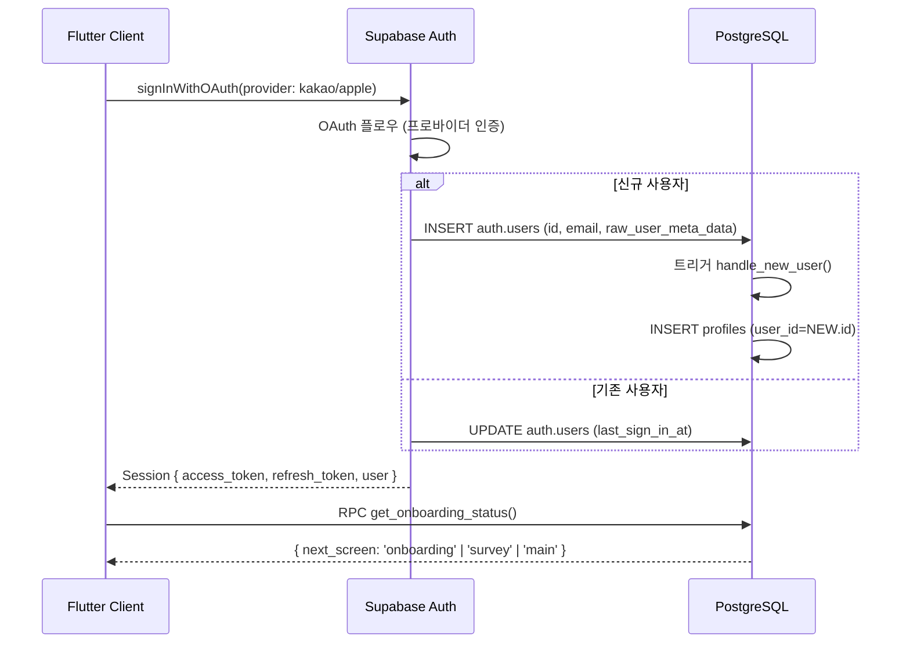
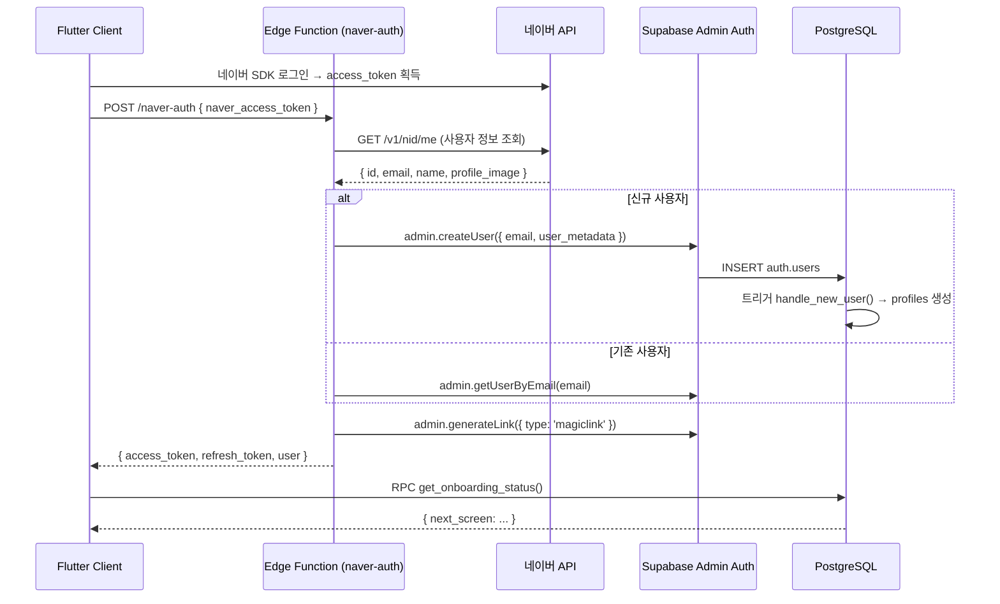
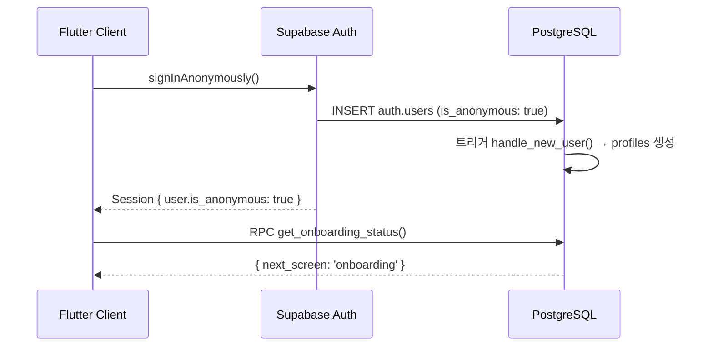
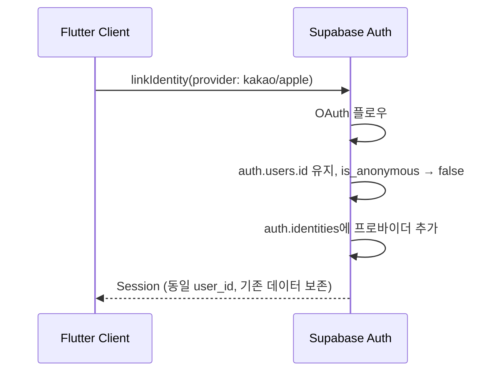
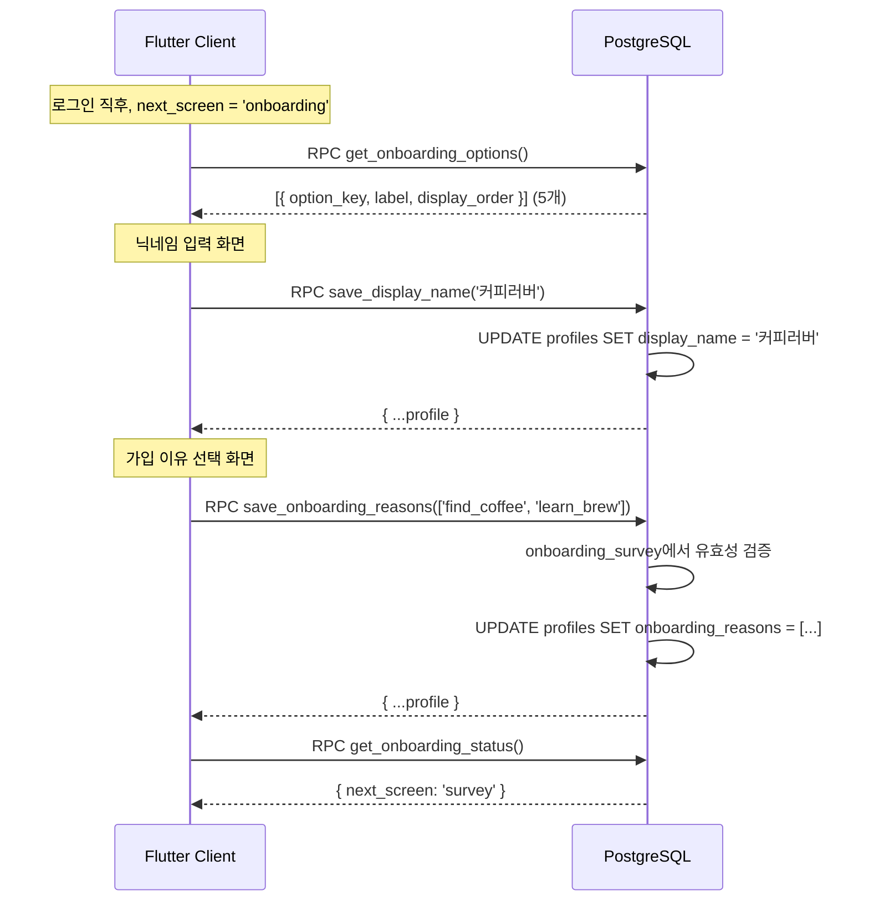

# 1. 인증/온보딩 플로우

## 관련 리소스

| 구분 | 이름 | 역할 |
|------|------|------|
| **테이블** | `auth.users` | Supabase 관리, 인증 정보 저장 |
| **테이블** | `profiles` | 사용자 프로필 확장 (display_name, onboarding_reasons 등) |
| **테이블** | `onboarding_survey` | 온보딩 가입 이유 선택지 (참조 데이터, 5개) |
| **트리거** | `handle_new_user` | auth.users INSERT → profiles 자동 생성 |
| **RPC** | `get_onboarding_status()` | 로그인 후 다음 화면 결정 |
| **RPC** | `get_onboarding_options()` | 온보딩 가입 이유 선택지 조회 |
| **RPC** | `save_display_name(text)` | 닉네임 저장 |
| **RPC** | `save_onboarding_reasons(text[])` | 가입 이유 저장 |
| **Edge Function** | `naver-auth` | 네이버 OAuth → Supabase Admin 사용자 생성 |

## RLS 정책

| 테이블 | 정책 | 조건 |
|--------|------|------|
| `profiles` | `profiles_select_own` (SELECT) | `user_id = (select auth.uid())` |
| `profiles` | `profiles_update_own` (UPDATE) | `user_id = (select auth.uid())` |
| `onboarding_survey` | `onboarding_survey_select_all` (SELECT) | `true` (공개 읽기) |

---

## 1-1. 소셜 로그인 (카카오/애플)



## 1-2. 네이버 로그인



## 1-3. 게스트 로그인



## 1-4. 게스트 → 소셜 전환



> **핵심**: `linkIdentity`는 `auth.users.id`를 변경하지 않으므로 profiles, survey_sessions 등 모든 FK 관계가 그대로 유지된다.

## 1-5. 온보딩 진행



## 1-6. 온보딩 상태 판단 로직

`get_onboarding_status()` RPC의 분기 로직:

```
1. profiles.display_name 없음 → 'onboarding'
2. profiles.onboarding_reasons 빈 배열 → 'onboarding'
3. survey_sessions에 status='analyzed' 없음 → 'survey'
4. recommendations 없음 (설문 완료, 추천 미생성) → 'survey_result'
5. 모두 완료 → 'main'
```

응답 형식:
```json
{
  "has_profile": true,
  "has_nickname": true,
  "has_signup_reasons": true,
  "has_completed_survey": false,
  "has_recommendations": false,
  "latest_survey_type": null,
  "next_screen": "survey"
}
```

## 테이블 데이터 흐름 요약

```
auth.users (Supabase Auth 관리)
  │ 트리거: handle_new_user
  ▼
profiles
  ├─ display_name ← save_display_name()
  ├─ onboarding_reasons ← save_onboarding_reasons()
  ├─ is_dark_mode ← update_profile() RPC
  ├─ avatar_url ← update_profile() RPC
  └─ coffee_level ← update_profile() RPC

onboarding_survey (참조 데이터, 5행)
  └─ get_onboarding_options() → 클라이언트 표시
```

---

## Supabase Auth 테이블 구조

### auth.users — 사용자 1행

| 컬럼 | 타입 | 역할 |
|------|------|------|
| `id` | UUID | **앱 전체 사용자 ID** — profiles 등 모든 FK가 참조 |
| `email` | VARCHAR | 프로바이더가 제공한 이메일 (없을 수 있음) |
| `is_anonymous` | BOOLEAN | 게스트 사용자 여부 |
| `raw_app_meta_data` | JSONB | `{ "provider": "kakao", "providers": ["kakao"] }` |
| `raw_user_meta_data` | JSONB | `{ "name": "홍길동", "avatar_url": "..." }` |
| `last_sign_in_at` | TIMESTAMPTZ | 마지막 로그인 시각 |
| `created_at` | TIMESTAMPTZ | 가입 일시 |

### auth.identities — 프로바이더별 1행

| 컬럼 | 타입 | 역할 |
|------|------|------|
| `user_id` | UUID | → auth.users.id 참조 |
| `provider` | TEXT | `"kakao"`, `"apple"`, `"naver"` 등 |
| `provider_id` | TEXT | 해당 프로바이더에서의 사용자 고유 ID |
| `identity_data` | JSONB | 프로바이더가 제공한 상세 사용자 정보 |

## Flutter 호출 예시

### 카카오/애플 (빌트인 OAuth)
```dart
await supabase.auth.signInWithOAuth(
  OAuthProvider.kakao,  // 또는 OAuthProvider.apple
  redirectTo: 'com.coflanet.app://callback',
);
```

### 네이버 (Edge Function)
```dart
// 1. Naver SDK 로그인 → code 획득
final naverCode = await NaverLoginSDK.authenticate();
// 2. Edge Function 호출
final response = await supabase.functions.invoke(
  'naver-auth',
  body: { 'code': naverCode },
);
// 3. 세션 설정
await supabase.auth.setSession(response.data['session']);
```

### 게스트
```dart
await supabase.auth.signInAnonymously();
```

### 게스트 → 소셜 전환
```dart
// 카카오/애플
await supabase.auth.linkIdentity(OAuthProvider.kakao);
// 네이버 (Edge Function 전환 모드)
await supabase.functions.invoke('naver-auth', body: { 'code': naverCode, 'mode': 'link' });
```

## Edge Function 상태

| 함수 | 상태 | verify_jwt | 비고 |
|------|------|:----------:|------|
| `naver-auth` | ACTIVE (v1) | `false` | Mock 버전 — 실제 네이버 연동 시 업데이트 필요 |

## 사전 설정 체크리스트

- [ ] Supabase Dashboard → Authentication → Providers → **Kakao** 활성화 (Client ID/Secret)
- [ ] Supabase Dashboard → Authentication → Providers → **Apple** 활성화 (Service ID/Secret)
- [ ] Supabase Dashboard → Authentication → Providers → **Anonymous Sign-ins** 활성화
- [ ] 네이버 개발자센터 → 앱 등록 → Client ID/Secret 발급
- [ ] Supabase Dashboard → Edge Function Secrets → `NAVER_CLIENT_ID`, `NAVER_CLIENT_SECRET`, `NAVER_REDIRECT_URI`
- [ ] Supabase Dashboard → Authentication → URL Configuration → Flutter 딥링크 콜백 URL 등록
- [x] Edge Function `naver-auth` 배포 (verify_jwt: false) — Mock 버전 배포 완료
