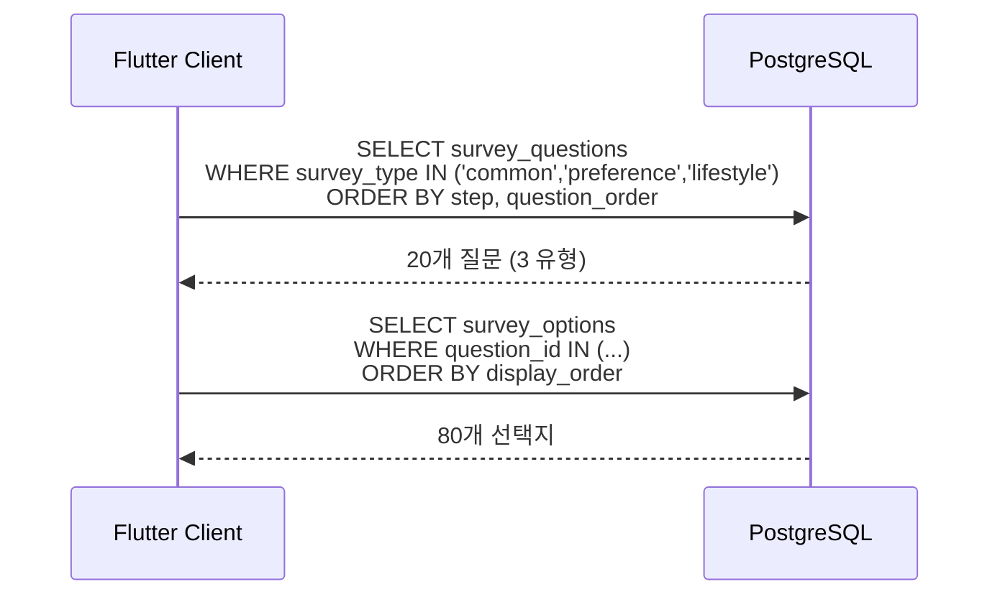
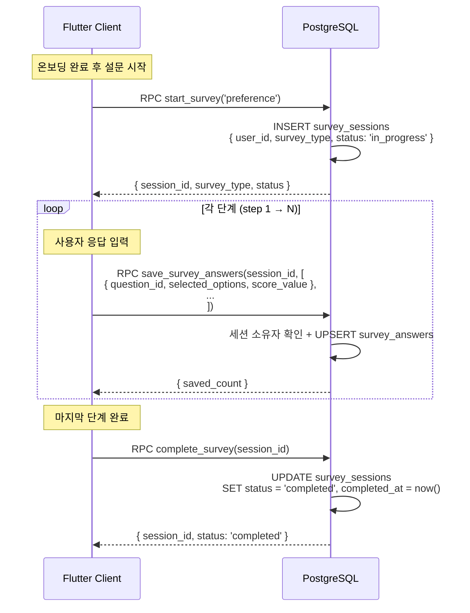
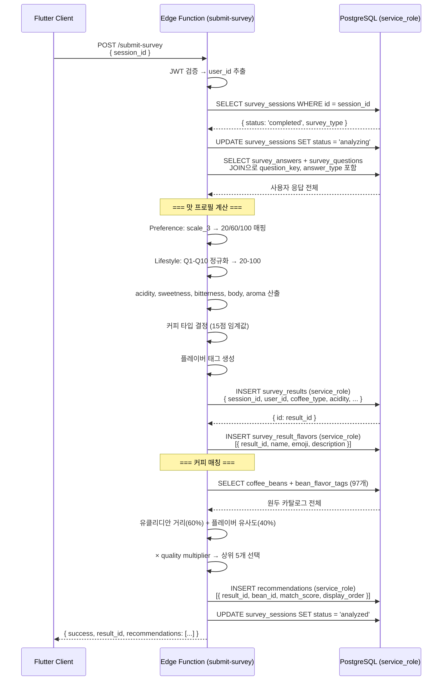
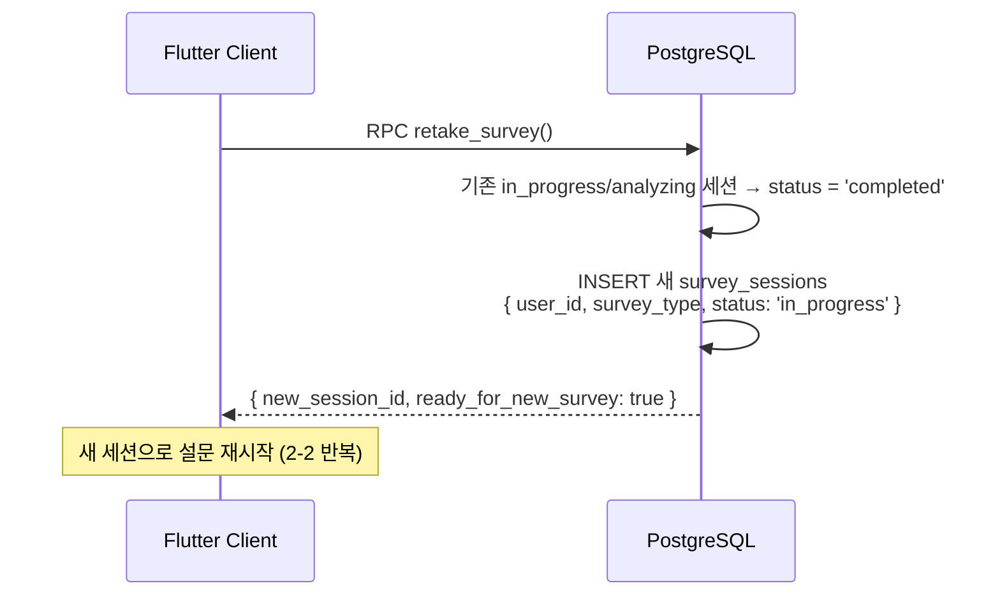

# 2. 설문 플로우

## 관련 리소스

| 구분 | 이름 | 역할 |
|------|------|------|
| **테이블** | `survey_questions` | 설문 질문 정의 (20개, 참조 데이터) |
| **테이블** | `survey_options` | 질문별 선택지 (80개, 참조 데이터) |
| **테이블** | `survey_sessions` | 설문 진행 상태 추적 |
| **테이블** | `survey_answers` | 질문별 사용자 응답 |
| **RPC** | `start_survey(p_survey_type)` | 새 설문 세션 생성 |
| **RPC** | `save_survey_answers(p_session_id, p_answers)` | 질문별 응답 일괄 저장 |
| **RPC** | `complete_survey(p_session_id)` | 설문 상태 → completed |
| **RPC** | `retake_survey()` | 기존 세션 종료 + 새 세션 생성 |
| **Edge Function** | `submit-survey` | 설문 완료 → 맛 프로필 → 추천 생성 |

## RLS 정책

| 테이블 | 정책 | 조건 |
|--------|------|------|
| `survey_questions` | `survey_questions_select_all` (SELECT) | `true` (authenticated 읽기) |
| `survey_options` | `survey_options_select_all` (SELECT) | `true` (authenticated 읽기) |
| `survey_sessions` | `survey_sessions_select_own` (SELECT) | `user_id = (select auth.uid())` |
| `survey_sessions` | `survey_sessions_insert_authenticated` (INSERT) | `user_id = (select auth.uid())` |
| `survey_sessions` | `survey_sessions_update_own` (UPDATE) | `user_id = (select auth.uid())` |
| `survey_answers` | `survey_answers_select_own` (SELECT) | `session_id` → survey_sessions 소유자 확인 |
| `survey_answers` | `survey_answers_insert_authenticated` (INSERT) | `session_id` → survey_sessions 소유자 확인 |
| `survey_answers` | `survey_answers_update_own` (UPDATE) | `session_id` → survey_sessions 소유자 확인 |

> **역할**: 모든 RLS 정책은 `authenticated` 역할에만 적용. 미인증 사용자는 참조 데이터 포함 접근 불가.

---

## 2-1. 설문 질문/선택지 조회



### 설문 유형/구조

| survey_type | 단계 (step) | 질문 수 | 카테고리 |
|-------------|-------------|---------|----------|
| `common` | 1 | 2개 | coffee_experience |
| `preference` | 2 | 4개 | taste_basic |
| `preference` | 3 | 4개 | taste_aroma |
| `lifestyle` | 2 | 4개 | lifestyle |
| `lifestyle` | 3 | 3개 | taste_basic |
| `lifestyle` | 4 | 3개 | sensory |

> **구조**: step 1은 공통(common), step 2 이후는 survey_type에 따라 분기. preference는 총 8문항(step 2-3), lifestyle은 총 10문항(step 2-4).

### 응답 형식 (answer_type)

| 타입 | 설명 | 저장 방식 |
|------|------|-----------|
| `single_select` | 단일 선택 | `selected_options = ['key']` |
| `multi_select` | 복수 선택 | `selected_options = ['key1','key2']` |
| `scale_3` | 3점 척도 | `score_value = 1\|2\|3` |
| `scale_5` | 5점 척도 | `score_value = 1~5` |
| `binary` | 이진 선택 | `selected_options = ['yes'\|'no']` |

## 2-2. 설문 세션 생성 및 응답 저장



## 2-3. 설문 제출 (Edge Function)



### 커피 타입 결정 로직

```
max(acidity, sweetness, bitterness, body) - second_max >= 15 이면:
  acidity 최대 → 'acidity' (산미형)
  sweetness 최대 → 'sweet' (달콤형)
  bitterness 최대 → 'strong' (강렬형)
  body 최대 → 'strong' (강렬형)
차이 < 15 → 'balance' (균형형)
```

## 2-4. 설문 재시도



> **주의**: 이전 survey_results, recommendations는 삭제하지 않는다. 새 설문 완료 시 새 결과가 생성되며, `get_my_taste_profile()`과 `get_my_recommendations()`는 항상 최신 결과(`ORDER BY created_at DESC LIMIT 1`)를 반환한다.

## 세션 상태 머신

```
┌─────────────┐
│ in_progress │ ← 생성 시 초기 상태
└──────┬──────┘
       │ 사용자: 마지막 답변 완료
       ▼
┌─────────────┐
│  completed  │ ← 클라이언트에서 직접 UPDATE
└──────┬──────┘
       │ Edge Function: submit-survey 시작
       ▼
┌─────────────┐
│  analyzing  │ ← Edge Function 처리 중
└──────┬──────┘
       │ Edge Function: 결과 저장 완료
       ▼
┌─────────────┐
│  analyzed   │ ← 최종 완료 상태
└─────────────┘
```

## 테이블 데이터 흐름 요약

```
survey_questions (참조, 20행) ─┐
survey_options (참조, 80행) ───┤ 클라이언트 읽기 전용
                                │
survey_sessions ◄── 클라이언트 INSERT/UPDATE
  │ session_id
  ├── survey_answers ◄── 클라이언트 INSERT
  │     │ question_id → survey_questions
  │
  └── survey_results ◄── Edge Function INSERT (service_role)
        │ result_id
        ├── survey_result_flavors ◄── Edge Function INSERT (service_role)
        └── recommendations ◄── Edge Function INSERT (service_role)
```
