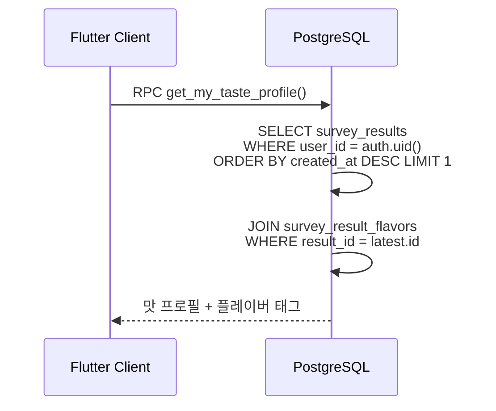
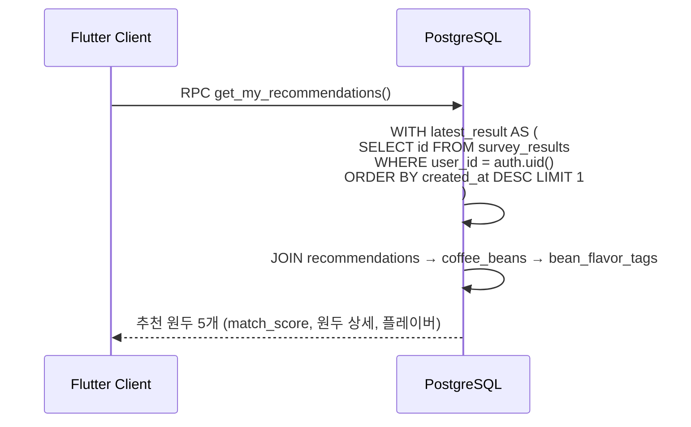
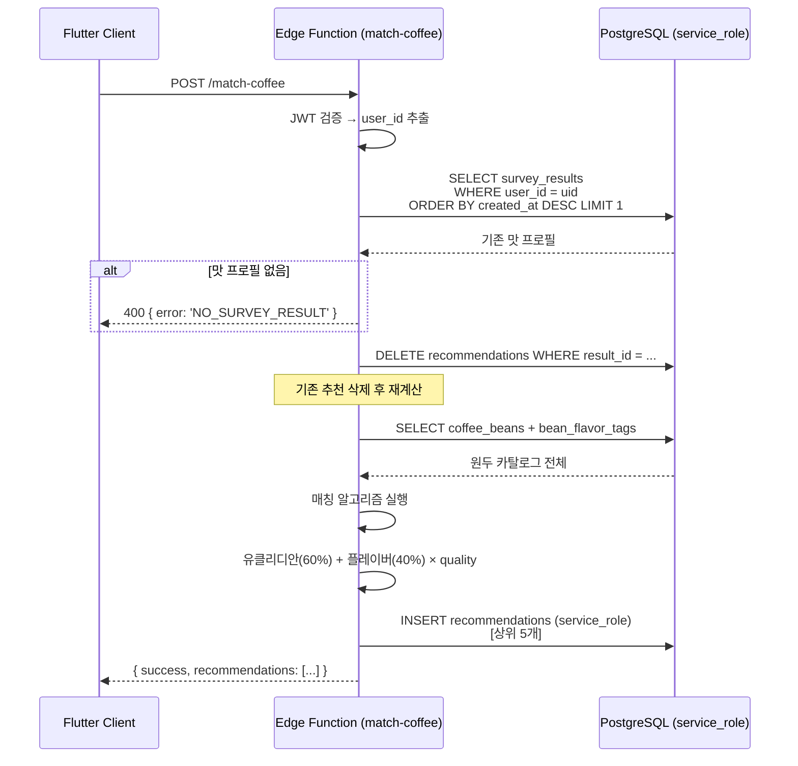

# 3. 추천/매칭 플로우

## 관련 리소스

| 구분 | 이름 | 역할 |
|------|------|------|
| **테이블** | `survey_results` | 맛 프로필 (acidity, sweetness, bitterness, body, aroma 0-100) |
| **테이블** | `survey_result_flavors` | 사용자 플레이버 태그 (이름, 이모지, 설명) |
| **테이블** | `recommendations` | 매칭 결과 (result_id → bean_id, match_score) |
| **테이블** | `coffee_beans` | 원두 카탈로그 (97개, 맛 점수 포함) |
| **테이블** | `bean_flavor_tags` | 원두별 플레이버 태그 (187개) |
| **RPC** | `get_my_taste_profile()` | 최신 맛 프로필 조회 |
| **RPC** | `get_my_recommendations()` | 최신 추천 원두 조회 |
| **Edge Function** | `submit-survey` | 설문 완료 → 맛 프로필 + 추천 생성 |
| **Edge Function** | `match-coffee` | 기존 맛 프로필로 재매칭 |

## RLS 정책

| 테이블 | 정책 | 조건 |
|--------|------|------|
| `survey_results` | `survey_results_select_own` (SELECT) | `user_id = (select auth.uid())` |
| `survey_results` | `survey_results_update_own` (UPDATE) | `user_id = (select auth.uid())` |
| `survey_result_flavors` | `survey_result_flavors_select_own` (SELECT) | `result_id` → survey_results 소유자 확인 |
| `recommendations` | `recommendations_select_own` (SELECT) | `result_id` → survey_results 소유자 확인 |
| `coffee_beans` | `coffee_beans_select_all` (SELECT) | `true` (authenticated 읽기) |
| `bean_flavor_tags` | `bean_flavor_tags_select_all` (SELECT) | `true` (authenticated 읽기) |

> **INSERT 권한**: survey_results, survey_result_flavors, recommendations는 **RLS INSERT 정책이 없다**. Edge Function에서 service_role로만 삽입 가능.

---

## 3-1. 맛 프로필 조회



응답 예시:
```json
{
  "id": "uuid",
  "coffee_type": "acidity",
  "coffee_type_label": "산미형",
  "coffee_type_description": "밝고 생동감 있는 커피를 선호합니다",
  "acidity": 85,
  "sweetness": 60,
  "bitterness": 30,
  "body": 45,
  "aroma": 70,
  "flavors": [
    { "name": "시트러스", "emoji": "🍊", "description": "상큼한 감귤 향" },
    { "name": "베리", "emoji": "🫐", "description": "달콤한 과일 향" }
  ]
}
```

## 3-2. 추천 원두 조회



응답 예시:
```json
{
  "result_id": "uuid",
  "recommendations": [
    {
      "id": "uuid",
      "match_score": 0.92,
      "display_order": 1,
      "recommendation_reason": "산미와 과일 향이 잘 맞습니다",
      "bean": {
        "id": "uuid",
        "name": "에티오피아 예가체프",
        "origin": ["Ethiopia"],
        "roast_level": "light",
        "acidity": 90,
        "sweetness": 65,
        "bitterness": 25,
        "body": 40,
        "aroma": 80,
        "flavor_tags": [
          { "category": "Fruity", "sub_category": "Berry", "descriptor": "Blueberry" }
        ]
      }
    }
  ]
}
```

## 3-3. 재매칭 (match-coffee Edge Function)



## 3-4. 매칭 알고리즘 상세

### 점수 산출 공식

```
total_score = euclidean_score × 0.6 + flavor_score × 0.4

euclidean_score:
  거리 = sqrt(Σ(user[i] - bean[i])²)  (5차원: acidity, sweetness, bitterness, body, aroma)
  최대거리 = sqrt(5 × 100²) ≈ 223.6
  점수 = 1 - (거리 / 최대거리)

flavor_score:
  사용자 coffee_type에 따른 descriptor weights (97개 정적 맵)
  원두의 bean_flavor_tags와 매칭 → 가중 합산 → 정규화

quality_multiplier:
  external_review_count 기반 보정 (있는 경우)
```

### 커피 타입별 플레이버 가중치 방향

| coffee_type | 높은 가중치 카테고리 | 낮은 가중치 카테고리 |
|-------------|---------------------|---------------------|
| `acidity` | Fruity, Floral | Roasted |
| `sweet` | Nutty_Cocoa, Fruity | Roasted |
| `strong` | Roasted, Nutty_Cocoa | Floral |
| `balance` | 모든 카테고리 균등 | - |

## 테이블 데이터 흐름 요약

```
survey_results (Edge Function이 생성)
  │
  ├── survey_result_flavors (Edge Function이 생성)
  │     → get_my_taste_profile()로 조회
  │
  └── recommendations (Edge Function이 생성)
        │ bean_id
        ▼
        coffee_beans (참조, 97행)
          │
          └── bean_flavor_tags (참조, 187행)
                → get_my_recommendations()로 조회
```
