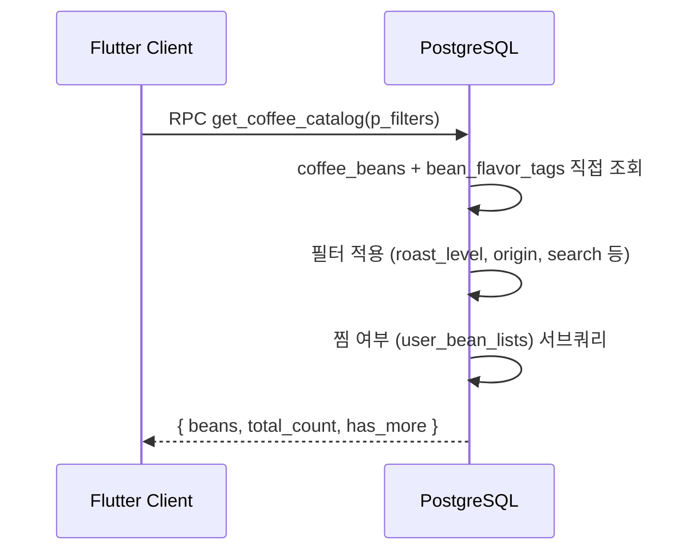
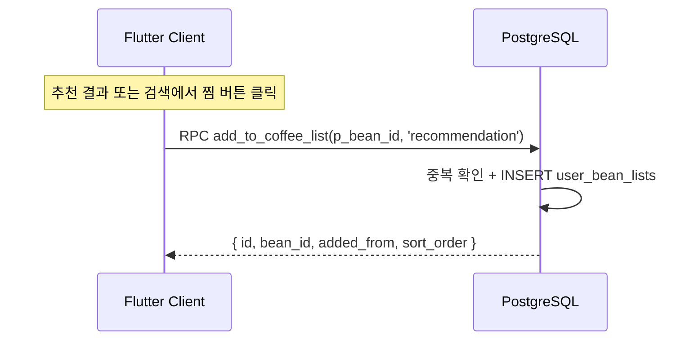
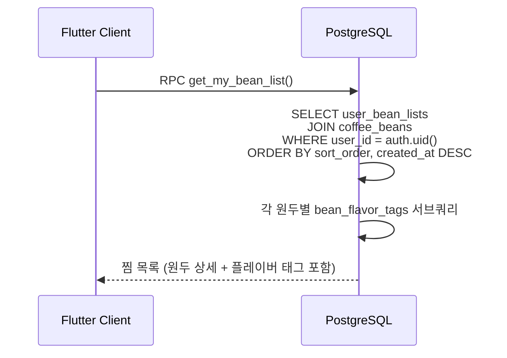
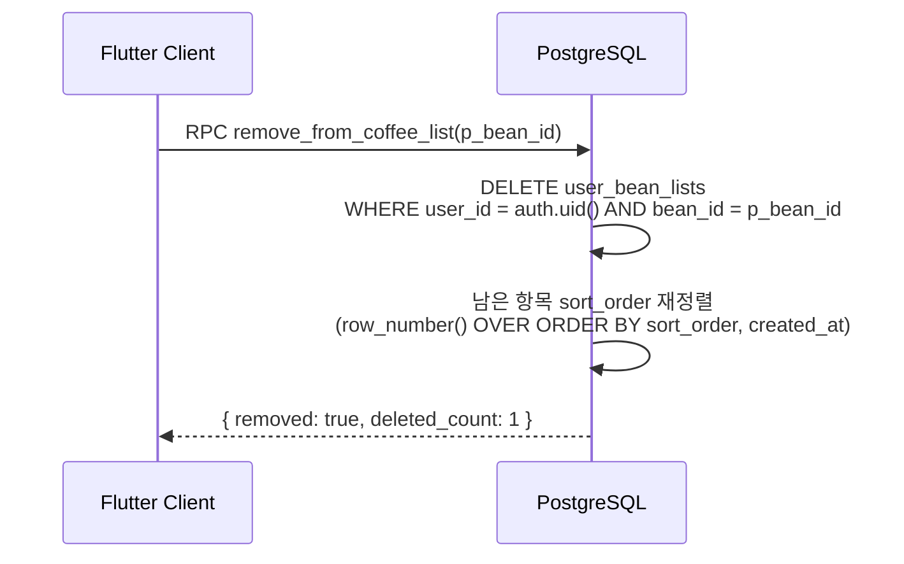
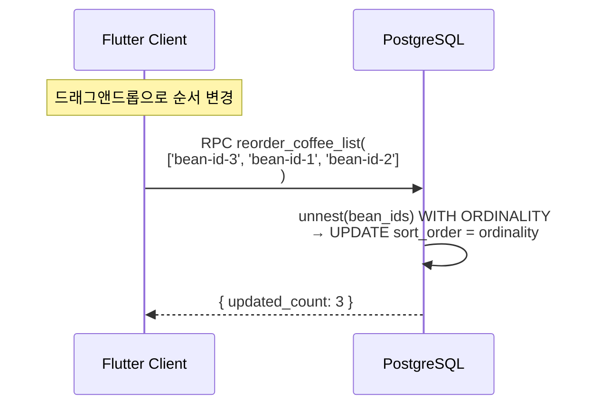
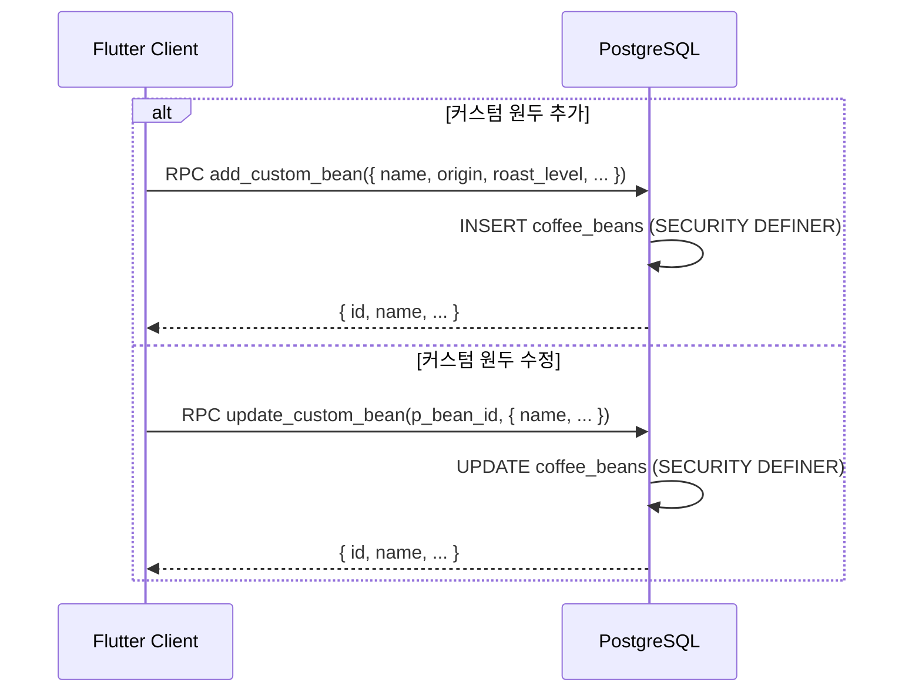

# 4. 원두 카탈로그/찜 플로우

## 관련 리소스

| 구분 | 이름 | 역할 |
|------|------|------|
| **테이블** | `coffee_beans` | 원두 카탈로그 (97개, 공개 읽기) |
| **테이블** | `bean_flavor_tags` | 원두별 플레이버 태그 (187개, 공개 읽기) |
| **테이블** | `user_bean_lists` | 사용자 찜 목록 (본인만 CRUD) |
| **RPC** | `get_coffee_catalog(p_filters)` | 원두 카탈로그 필터 조회 (플레이버 포함) |
| **RPC** | `get_my_bean_list()` | 찜 목록 조회 (원두 상세 + 플레이버 포함) |
| **RPC** | `add_to_coffee_list(p_bean_id, p_added_from)` | 찜 추가 |
| **RPC** | `remove_from_coffee_list(bean_id)` | 찜 해제 + 자동 순서 재정렬 |
| **RPC** | `reorder_coffee_list(bean_ids[])` | 찜 목록 순서 변경 |
| **RPC** | `add_custom_bean(p_values)` | 커스텀 원두 추가 (SECURITY DEFINER) |
| **RPC** | `update_custom_bean(p_bean_id, p_values)` | 커스텀 원두 수정 (SECURITY DEFINER) |
| **뷰** | `v_coffee_bean_catalog` | 원두 + 플레이버 태그 JOIN 뷰 |
| **트리거** | `reorder_bean_list_after_delete` | 삭제 후 sort_order 자동 재정렬 |

## RLS 정책

| 테이블 | 정책 | 조건 |
|--------|------|------|
| `coffee_beans` | `coffee_beans_select_all` (SELECT) | `true` (authenticated 읽기) |
| `bean_flavor_tags` | `bean_flavor_tags_select_all` (SELECT) | `true` (authenticated 읽기) |
| `user_bean_lists` | `user_bean_lists_select_own` (SELECT) | `user_id = (select auth.uid())` |
| `user_bean_lists` | `user_bean_lists_insert_authenticated` (INSERT) | `user_id = (select auth.uid())` |
| `user_bean_lists` | `user_bean_lists_update_own` (UPDATE) | `user_id = (select auth.uid())` |
| `user_bean_lists` | `user_bean_lists_delete_own` (DELETE) | `user_id = (select auth.uid())` |

> **역할**: 모든 RLS 정책은 `authenticated` 역할 전용. coffee_beans INSERT/UPDATE 정책 없음 — `add_custom_bean`, `update_custom_bean`은 SECURITY DEFINER로 실행.

---

## 4-1. 원두 카탈로그 조회



> **참고**: `v_coffee_bean_catalog` 뷰는 존재하지만, `get_coffee_catalog()` RPC는 필터링/페이지네이션/찜 여부를 위해 coffee_beans + bean_flavor_tags를 직접 쿼리한다.

### coffee_beans 주요 필드

| 필드 | 타입 | 설명 |
|------|------|------|
| `name` | text | 원두 이름 |
| `origin` | text[] | 원산지 (복수 블렌딩) |
| `roast_level` | text | light / medium / medium_dark / dark |
| `roast_point` | smallint | 1-10 |
| `variety` | text | 품종 (예: SL28, Gesha) |
| `processing` | text | 가공 방식 (예: washed, natural) |
| `acidity`, `sweetness`, `bitterness`, `body`, `aroma` | smallint | 맛 점수 0-100 |
| `description` | text | 원두 소개 문구 |
| `image_url` | text | 원두 이미지 URL |
| `original_price`, `discount_price`, `discount_percent` | int/smallint | 가격 정보 |
| `weight` | text | 용량 (예: 200g) |
| `purchase_url` | text | 구매 링크 |
| `stock` | int | 재고 수량 |
| `is_available` | boolean | 판매 가능 여부 |
| `external_review_count` | int | 외부 리뷰 수 (매칭 quality multiplier에 사용) |

### bean_flavor_tags 구조

```
category (대분류)     sub_category (중분류)   descriptor (세부)    descriptor_ko (한국어)
─────────────────────────────────────────────────────────────────────────────────────
Fruity               Berry                  Blueberry           블루베리
Fruity               Citrus                 Lemon               레몬
Floral               -                      Jasmine             자스민
Nutty_Cocoa          Nutty                  Almond              아몬드
Nutty_Cocoa          Cocoa                  Dark Chocolate      다크 초콜릿
Roasted              -                      Smoky               스모키
```

## 4-2. 원두 찜하기



### added_from 값

| 값 | 의미 | 시나리오 |
|----|------|----------|
| `recommendation` | 추천 결과에서 추가 | 매칭 결과 화면에서 찜 |
| `search` | 검색에서 추가 | 원두 검색/목록에서 찜 |
| `manual` | 직접 추가 | 기타 경로 |

## 4-3. 찜 목록 조회



응답 예시:
```json
[
  {
    "id": "list-item-uuid",
    "added_from": "recommendation",
    "sort_order": 1,
    "created_at": "2026-02-28T...",
    "bean": {
      "id": "bean-uuid",
      "name": "에티오피아 예가체프",
      "origin": ["Ethiopia"],
      "roast_level": "light",
      "acidity": 90,
      "flavor_tags": [
        { "category": "Fruity", "sub_category": "Berry", "descriptor": "Blueberry" }
      ]
    }
  }
]
```

## 4-4. 찜 해제



## 4-5. 찜 목록 순서 변경



## 4-6. 커스텀 원두 관리



> **SECURITY DEFINER**: coffee_beans에 클라이언트 INSERT/UPDATE RLS가 없으므로, RPC 내부에서 권한 검증 후 실행.

## 테이블 데이터 흐름 요약

```
coffee_beans (참조 97행 + 커스텀, authenticated 읽기)
  │
  ├── bean_flavor_tags (참조 187행, authenticated 읽기)
  │     → v_coffee_bean_catalog 뷰로 JOIN 제공
  │
  ├── get_coffee_catalog() → 필터 기반 카탈로그 조회
  ├── add_custom_bean() → 커스텀 원두 추가 (SECURITY DEFINER)
  ├── update_custom_bean() → 커스텀 원두 수정 (SECURITY DEFINER)
  │
  └── user_bean_lists ◄── RPC 기반 CRUD (RLS 본인만)
        │ user_id = (select auth.uid())
        ├── add_to_coffee_list() (찜 추가, added_from 기록)
        ├── get_my_bean_list() (원두+플레이버 JOIN)
        ├── remove_from_coffee_list() (삭제 + 자동 재정렬)
        └── reorder_coffee_list() (순서 변경)
```
