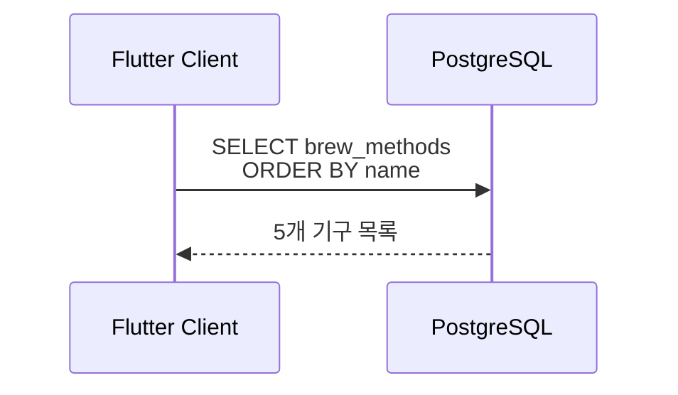
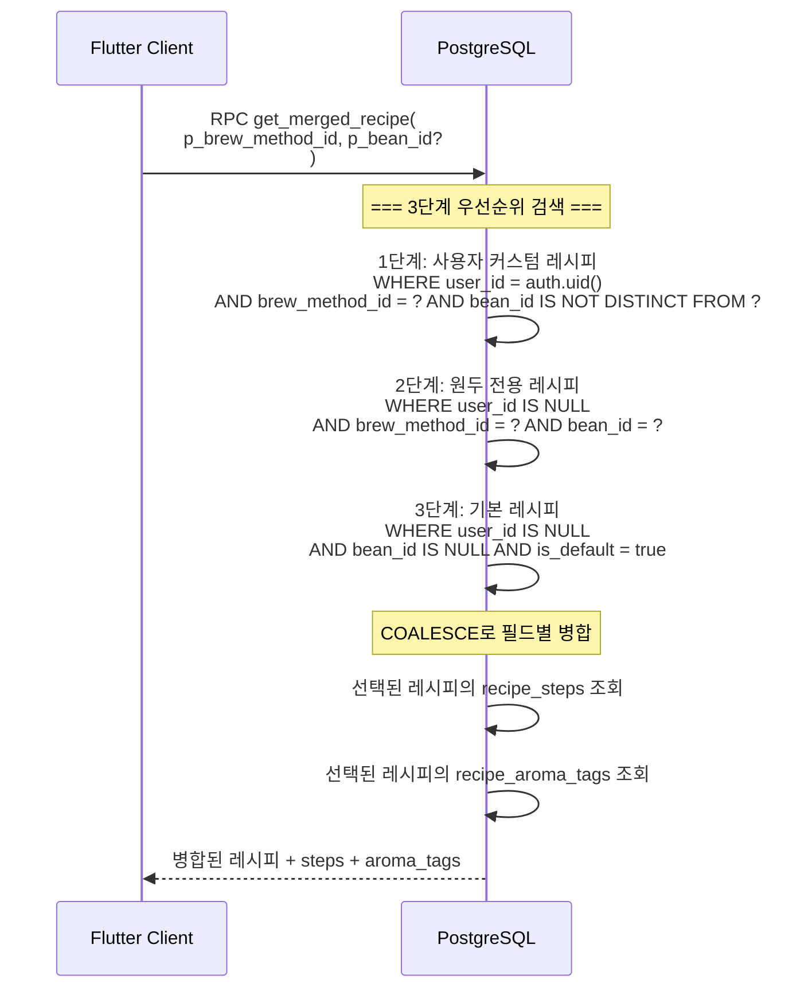
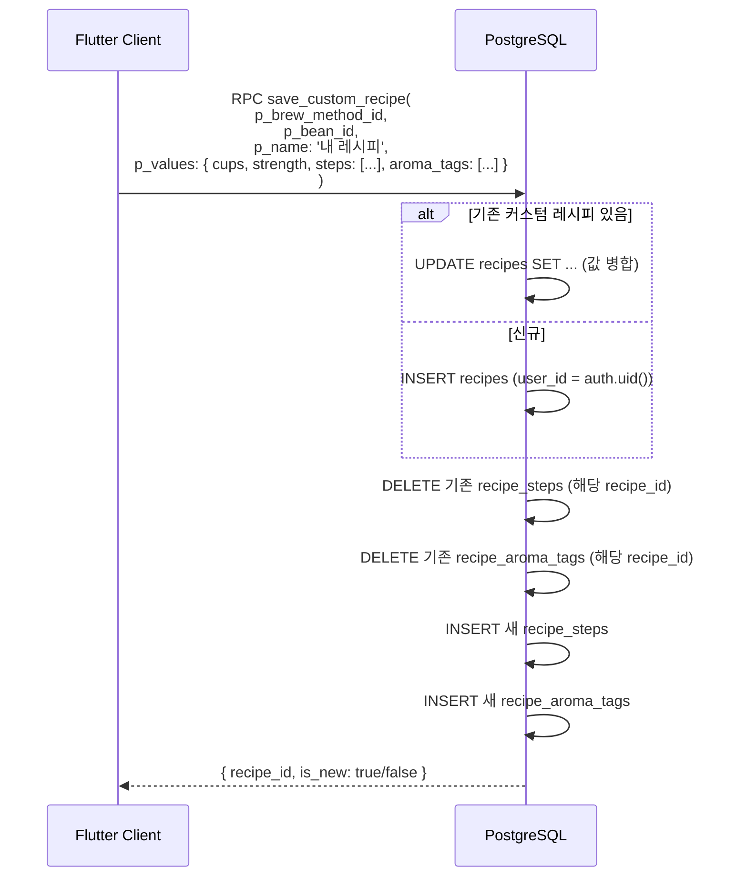
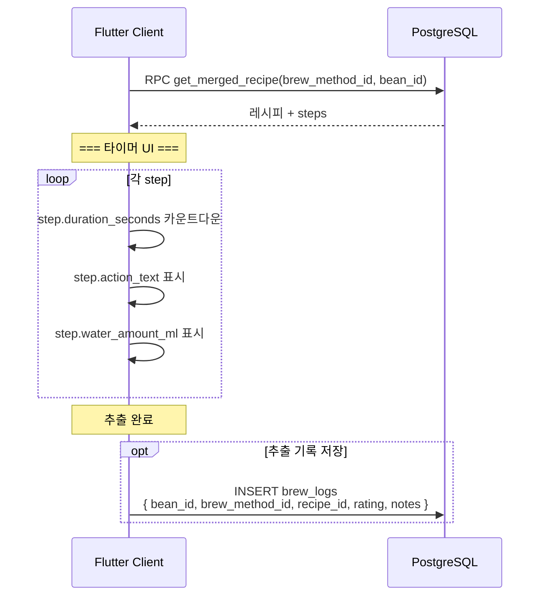
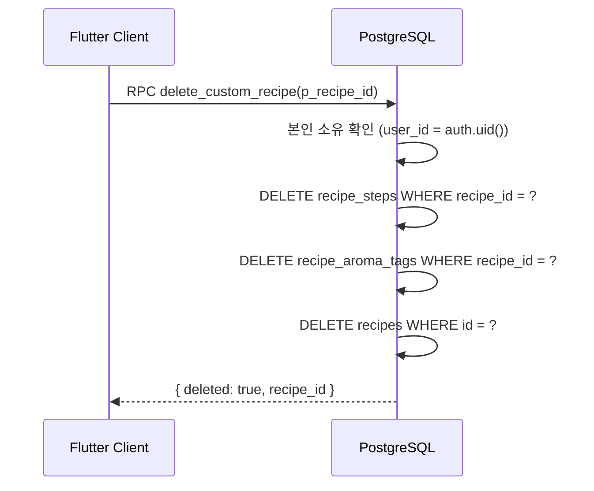

# 5. 레시피/타이머 플로우

## 관련 리소스

| 구분 | 이름 | 역할 |
|------|------|------|
| **테이블** | `brew_methods` | 추출 기구 마스터 (5개, 참조 데이터) |
| **테이블** | `recipes` | 레시피 (시스템 기본 4개 + 사용자 커스텀) |
| **테이블** | `recipe_steps` | 레시피별 추출 단계 (10개 시스템 + 사용자) |
| **테이블** | `recipe_aroma_tags` | 레시피 향미 태그 (10개 시스템 + 사용자) |
| **RPC** | `get_merged_recipe(brew_method_id, bean_id?)` | 3단계 병합 레시피 조회 |
| **RPC** | `save_custom_recipe(brew_method_id, bean_id, name, values)` | 커스텀 레시피 저장 |
| **RPC** | `delete_custom_recipe(p_recipe_id)` | 커스텀 레시피 삭제 (본인 소유만) |
| **뷰** | `v_recipe_overview` | 레시피 + brew_method + step_count + aroma_tags JOIN 뷰 |

## RLS 정책

| 테이블 | 정책 | 조건 |
|--------|------|------|
| `brew_methods` | `brew_methods_select_all` (SELECT) | `true` (공개) |
| `recipes` | `recipes_select_own_and_system` (SELECT) | `user_id IS NULL OR user_id = auth.uid()` |
| `recipes` | `recipes_insert_authenticated` (INSERT) | `user_id = auth.uid()` |
| `recipes` | `recipes_update_own` (UPDATE) | `user_id = auth.uid()` |
| `recipes` | `recipes_delete_own` (DELETE) | `user_id = auth.uid()` |
| `recipe_steps` | `recipe_steps_select_own_and_system` (SELECT) | recipe의 user_id 확인 |
| `recipe_steps` | `recipe_steps_insert_authenticated` (INSERT) | recipe의 user_id 확인 |
| `recipe_steps` | `recipe_steps_update_own` (UPDATE) | recipe의 user_id 확인 |
| `recipe_steps` | `recipe_steps_delete_own` (DELETE) | recipe의 user_id 확인 |
| `recipe_aroma_tags` | `recipe_aroma_tags_select_own_and_system` (SELECT) | recipe의 user_id 확인 |
| `recipe_aroma_tags` | `recipe_aroma_tags_insert_authenticated` (INSERT) | recipe의 user_id 확인 |
| `recipe_aroma_tags` | `recipe_aroma_tags_update_own` (UPDATE) | recipe의 user_id 확인 |
| `recipe_aroma_tags` | `recipe_aroma_tags_delete_own` (DELETE) | recipe의 user_id 확인 |

---

## 5-1. 추출 기구 조회



### brew_methods 현재 데이터

| slug | name | category | equipment |
|------|------|----------|-----------|
| `hario-v60` | 하리오 V60 | handdrip | 드리퍼, 필터, 서버, 주전기 |
| `kalita-wave` | 칼리타 웨이브 | handdrip | 드리퍼, 필터, 서버, 주전기 |
| `chemex` | 케멕스 | handdrip | 케멕스, 필터, 주전기 |
| `espresso-machine` | 에스프레소 머신 | machine | 에스프레소 머신, 탬퍼 |
| `moka-pot` | 모카포트 | machine | 모카포트, 열원 |

## 5-2. 레시피 3단계 병합 조회



### 병합 우선순위

```
source_level 우선순위:

1. 'user_custom'  — 사용자가 직접 만든 레시피 (최우선)
2. 'bean_default' — 특정 원두에 맞춤 설정된 시스템 레시피
3. 'base'         — 추출 기구별 기본 레시피 (폴백)
4. 'none'         — 해당 조건에 맞는 레시피 없음
```

응답 예시:
```json
{
  "source_level": "base",
  "recipe_id": "uuid",
  "brew_method_id": "uuid",
  "bean_id": null,
  "name": "하리오 V60 기본 레시피",
  "cups": 1,
  "strength": "balanced",
  "coffee_amount_g": 18,
  "water_temp_c": 93,
  "grind_size_um": 700,
  "total_water_ml": 210,
  "total_duration_seconds": 150,
  "steps": [
    {
      "step_number": 1,
      "title": "뜸 들이기",
      "step_type": "brewing",
      "water_amount_ml": 30,
      "duration_seconds": 30,
      "action_text": "원두 위에 물을 천천히 부어주세요",
      "illustration_emoji": "💧"
    },
    {
      "step_number": 2,
      "title": "1차 추출",
      "step_type": "brewing",
      "water_amount_ml": 100,
      "duration_seconds": 60
    }
  ],
  "aroma_tags": [
    { "emoji": "🌰", "name": "견과류", "display_order": 1 }
  ]
}
```

## 5-3. 커스텀 레시피 저장



> **핵심**: 동일 `(user_id, brew_method_id, bean_id)` 조합이면 기존 레시피를 UPDATE, 새 조합이면 INSERT. steps와 aroma_tags는 항상 전체 교체(DELETE → INSERT).

## 5-4. 타이머 실행 플로우



## 5-5. 커스텀 레시피 삭제



> **주의**: 시스템 기본 레시피(`user_id IS NULL`)는 삭제할 수 없다. 본인 소유 커스텀 레시피만 삭제 가능.

## recipe_steps.step_type 설명

| step_type | 설명 | 타이머 동작 |
|-----------|------|-------------|
| `preparation` | 준비 단계 (원두 분쇄, 예열) | 카운트다운 또는 사용자 확인 |
| `brewing` | 추출 단계 (물 붓기) | 카운트다운 + 물 양 표시 |
| `waiting` | 대기 단계 (뜸 들이기, 마무리) | 카운트다운 |

## 테이블 데이터 흐름 요약

```
brew_methods (참조, 5행, 공개 읽기)
  │ brew_method_id
  ▼
recipes
  ├── user_id IS NULL → 시스템 기본 (4개)
  ├── user_id = auth.uid() → 사용자 커스텀
  │
  ├── recipe_steps (1:N)
  │     step_number 순 정렬 → 타이머 실행
  │
  └── recipe_aroma_tags (1:N)
        향미 키워드 표시

조회: get_merged_recipe() → 3단계 우선순위 병합
저장: save_custom_recipe() → UPSERT + steps/tags 전체 교체
```
