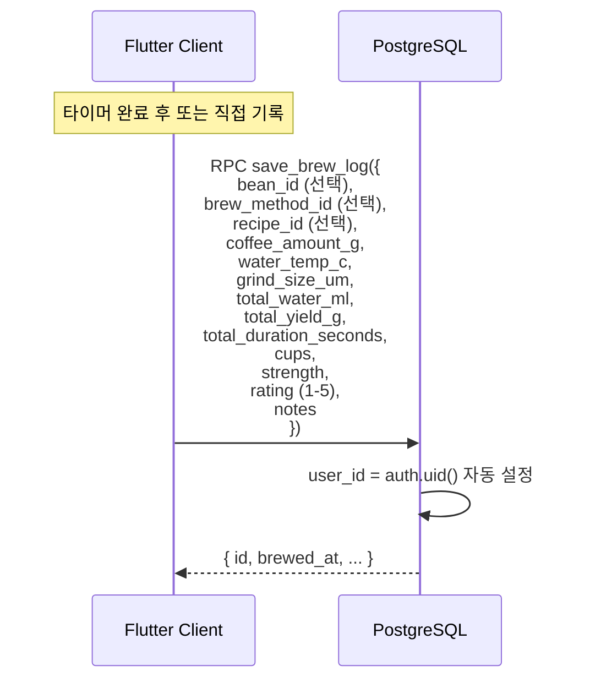
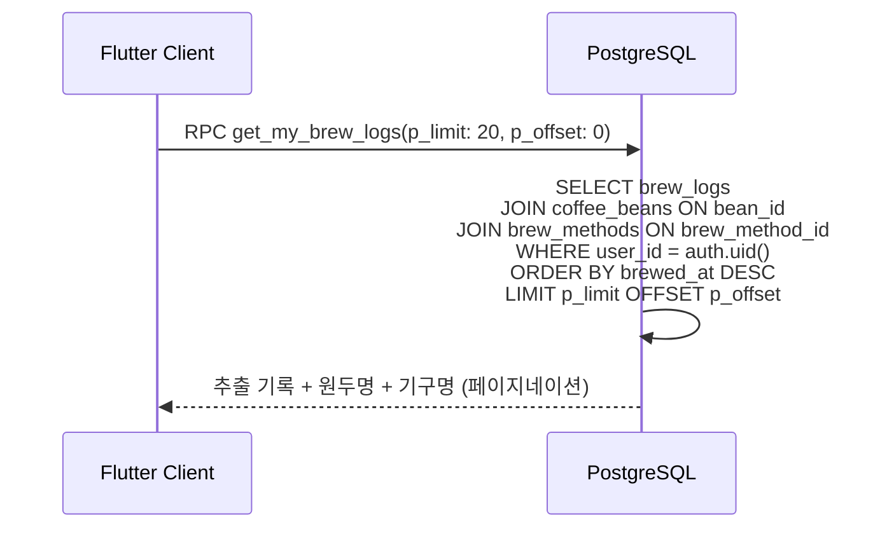
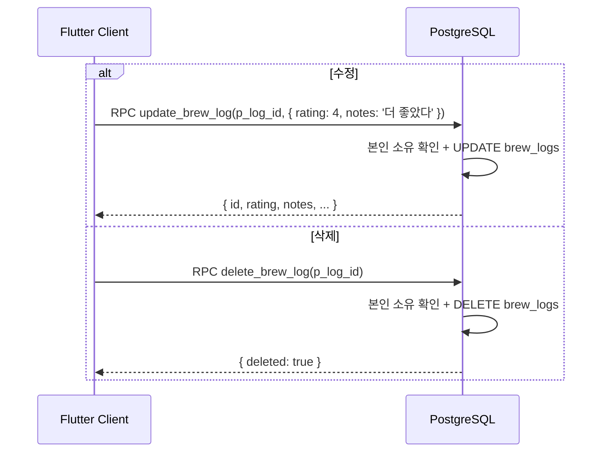
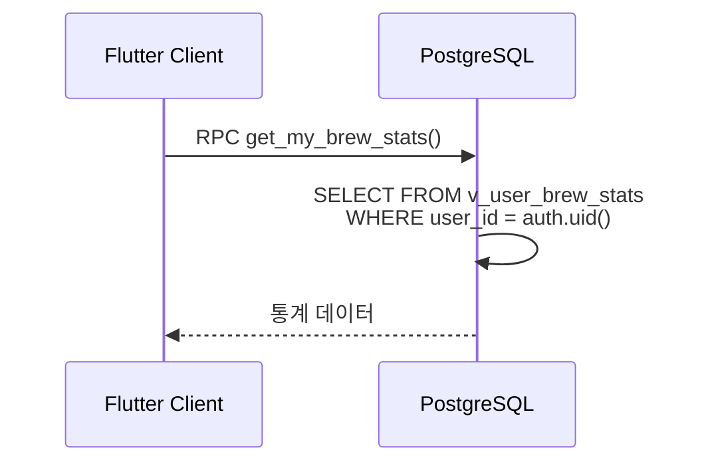

# 6. 추출 기록 플로우

## 관련 리소스

| 구분 | 이름 | 역할 |
|------|------|------|
| **테이블** | `brew_logs` | 추출 이력 (본인만 CRUD) |
| **RPC** | `save_brew_log(p_values)` | 추출 기록 저장 |
| **RPC** | `get_my_brew_logs(p_limit, p_offset)` | 추출 기록 목록 (페이지네이션) |
| **RPC** | `update_brew_log(p_log_id, p_values)` | 추출 기록 수정 |
| **RPC** | `delete_brew_log(p_log_id)` | 추출 기록 삭제 |
| **RPC** | `get_my_brew_stats()` | 추출 통계 집계 |
| **뷰** | `v_user_brew_stats` | 사용자별 추출 통계 뷰 |

## RLS 정책

| 테이블 | 정책 | 조건 |
|--------|------|------|
| `brew_logs` | `brew_logs_select_own` (SELECT) | `user_id = (select auth.uid())` |
| `brew_logs` | `brew_logs_insert_authenticated` (INSERT) | `user_id = (select auth.uid())` |
| `brew_logs` | `brew_logs_update_own` (UPDATE) | `user_id = (select auth.uid())` |
| `brew_logs` | `brew_logs_delete_own` (DELETE) | `user_id = (select auth.uid())` |

---

## 6-1. 추출 기록 저장



### FK 관계 (모두 선택적)

| FK | 참조 테이블 | 의미 |
|----|------------|------|
| `bean_id` | `coffee_beans` | 사용한 원두 (없으면 NULL) |
| `brew_method_id` | `brew_methods` | 추출 기구 (없으면 NULL) |
| `recipe_id` | `recipes` | 사용한 레시피 (없으면 NULL) |

## 6-2. 추출 기록 목록 조회



## 6-3. 추출 기록 수정/삭제



## 6-4. 추출 통계 조회



응답 예시:
```json
{
  "total_brews": 15,
  "unique_beans": 8,
  "unique_methods": 3,
  "avg_rating": 3.8,
  "last_brewed_at": "2026-02-27T14:30:00Z"
}
```

기록이 없는 경우:
```json
{
  "total_brews": 0,
  "unique_beans": 0,
  "unique_methods": 0,
  "avg_rating": null,
  "last_brewed_at": null
}
```

### v_user_brew_stats 뷰 정의

```sql
-- brew_logs를 user_id별로 집계
SELECT user_id,
       count(*)                    AS total_brews,
       count(DISTINCT bean_id)     AS unique_beans,
       count(DISTINCT brew_method_id) AS unique_methods,
       round(avg(rating), 2)       AS avg_rating,
       max(brewed_at)              AS last_brewed_at
FROM brew_logs
GROUP BY user_id;
```

## 테이블 데이터 흐름 요약

```
brew_logs ◄── RPC 기반 CRUD (RLS 본인만)
  │ user_id = (select auth.uid())
  │
  ├── bean_id? → coffee_beans (선택적 참조)
  ├── brew_method_id? → brew_methods (선택적 참조)
  ├── recipe_id? → recipes (선택적 참조)
  │
  ├── save_brew_log() → 기록 저장
  ├── get_my_brew_logs() → 목록 조회 (페이지네이션)
  ├── update_brew_log() → 기록 수정
  ├── delete_brew_log() → 기록 삭제
  │
  └── v_user_brew_stats (뷰)
        → get_my_brew_stats() 집계 조회
```
