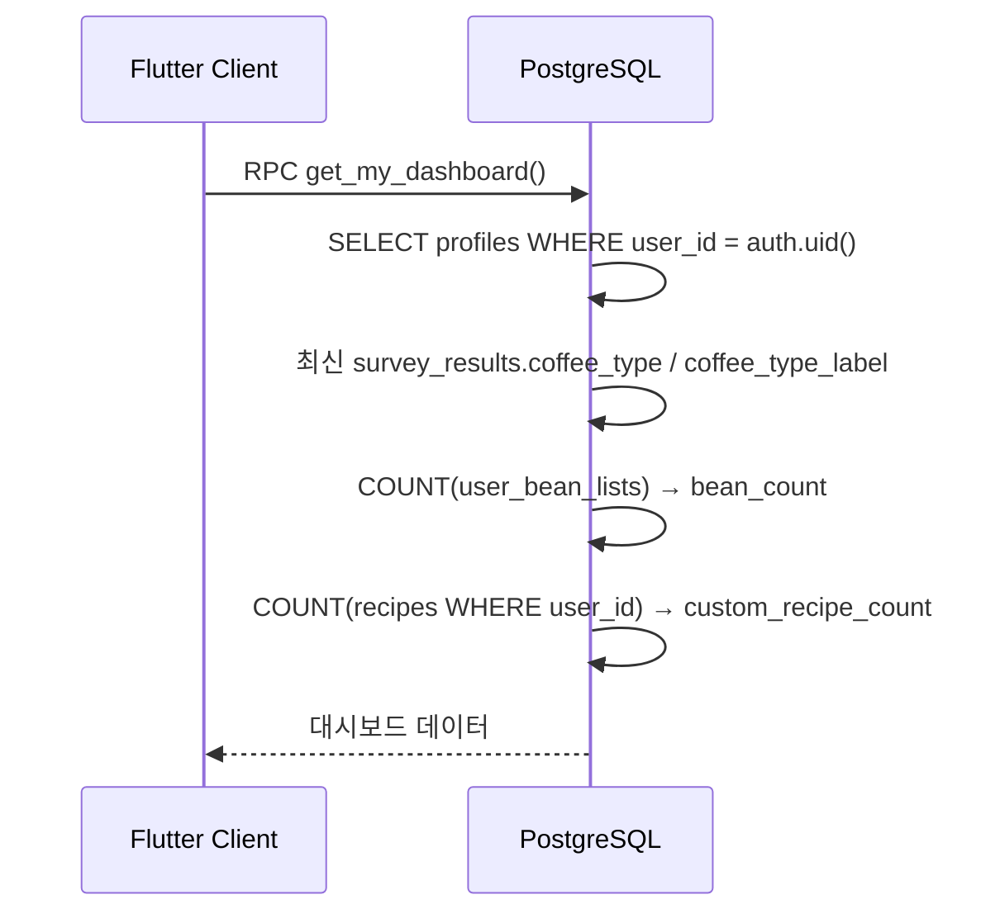
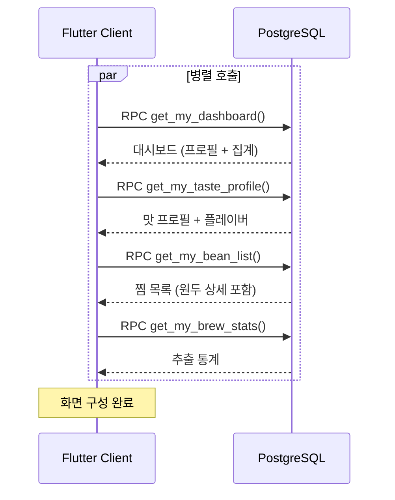
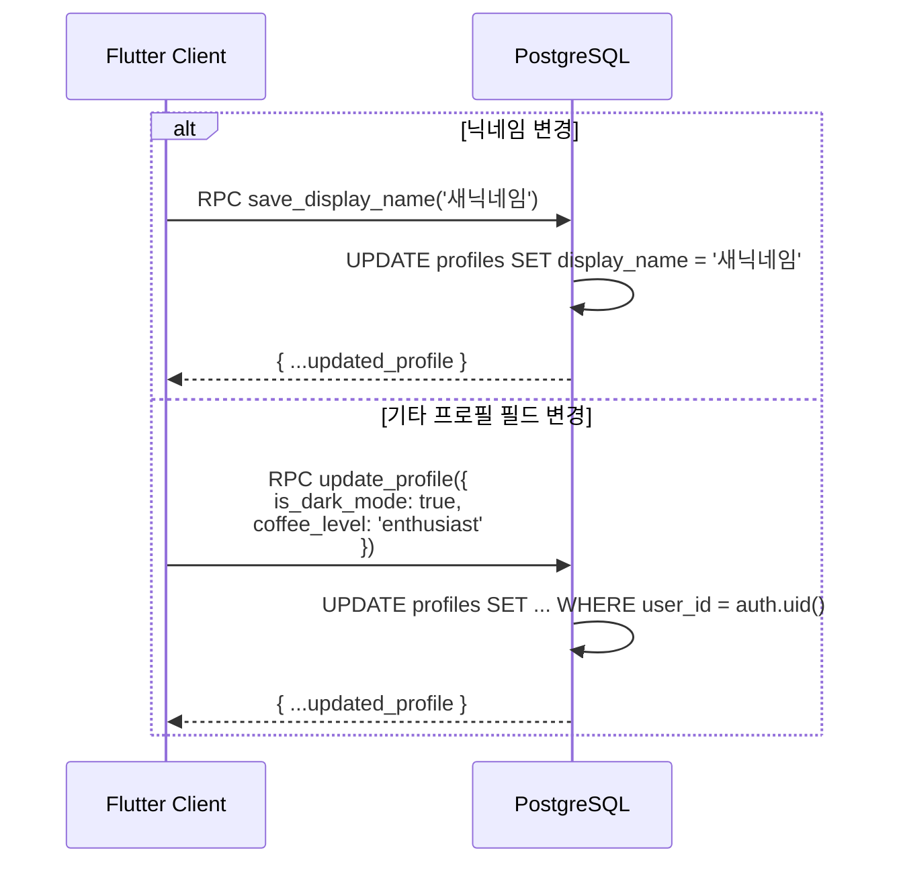
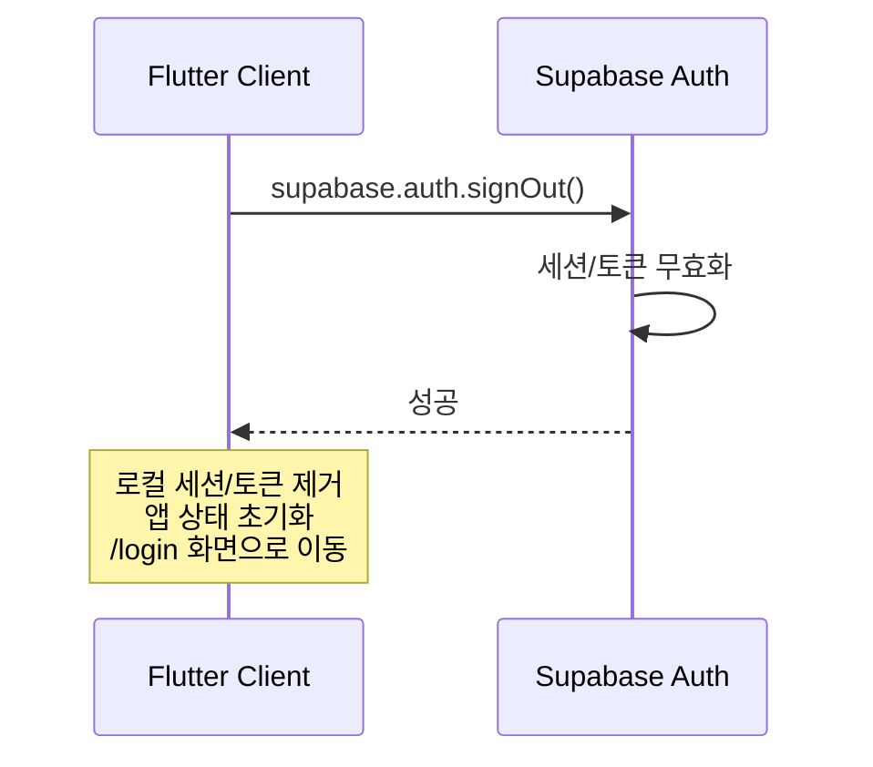
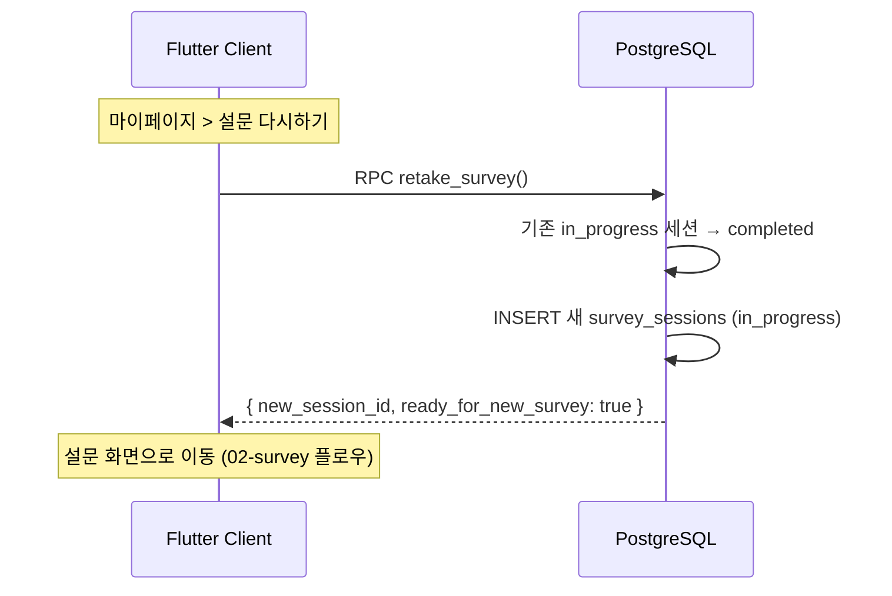

# 7. 마이페이지 플로우

## 관련 리소스

| 구분 | 이름 | 역할 |
|------|------|------|
| **RPC** | `get_my_dashboard()` | 마이페이지 대시보드 집계 조회 |
| **RPC** | `get_my_taste_profile()` | 내 맛 프로필 조회 |
| **RPC** | `get_my_recommendations()` | 내 추천 원두 조회 |
| **RPC** | `get_my_bean_list()` | 내 찜 목록 조회 |
| **RPC** | `get_my_brew_stats()` | 내 추출 통계 조회 |
| **RPC** | `update_profile(p_values)` | 프로필 필드 일괄 수정 |
| **테이블** | `profiles` | 사용자 프로필 (RPC를 통해 수정) |

> 마이페이지는 여러 도메인의 데이터를 집계하는 **읽기 중심** 플로우. 각 RPC는 `(select auth.uid())` 기반으로 본인 데이터만 반환.

---

## 7-1. 대시보드 조회



응답 예시:
```json
{
  "display_name": "커피러버",
  "is_dark_mode": false,
  "created_at": "2026-02-01T...",
  "latest_coffee_type": "acidity",
  "latest_coffee_type_label": "산미형",
  "bean_count": 5,
  "custom_recipe_count": 2
}
```

## 7-2. 마이페이지 전체 데이터 로딩



## 7-3. 프로필 수정



### 맛 프로필 점수→라벨 변환 (클라이언트 처리)

| 점수 범위 | 라벨 | 아이콘 의미 |
|-----------|------|-------------|
| 0-33 | 싫음 | 해당 맛 미선호 |
| 34-66 | 보통 | 중립 |
| 67-100 | 좋음 | 해당 맛 선호 |

> `aroma` 점수는 UI에 직접 표시하지 않고 내부 매칭 알고리즘에만 사용.

## 7-5. 로그아웃



## 7-4. 설문 재시도 (마이페이지에서)



## 마이페이지 화면 → 데이터 매핑

```
┌─────────────────────────────────────────────┐
│  마이페이지                                    │
│                                              │
│  ┌──────────────────────┐                   │
│  │ 프로필 섹션            │ ← get_my_dashboard() │
│  │ - 닉네임              │   profiles          │
│  │ - 커피 타입 (산미형)    │   survey_results    │
│  │ - 가입일              │   profiles          │
│  └──────────────────────┘                   │
│                                              │
│  ┌──────────────────────┐                   │
│  │ 맛 프로필              │ ← get_my_taste_profile() │
│  │ - 레이더 차트          │   survey_results    │
│  │ - 플레이버 태그        │   survey_result_flavors │
│  │ [설문 다시하기]        │   → retake_survey() │
│  └──────────────────────┘                   │
│                                              │
│  ┌──────────────────────┐                   │
│  │ 찜 목록 (5개)         │ ← get_my_bean_list() │
│  │ - 원두 카드            │   user_bean_lists   │
│  │ [전체보기]            │   + coffee_beans     │
│  └──────────────────────┘                   │
│                                              │
│  ┌──────────────────────┐                   │
│  │ 추출 통계             │ ← get_my_brew_stats() │
│  │ - 총 추출 횟수        │   brew_logs (집계)   │
│  │ - 사용 원두 수        │                     │
│  │ - 평균 평점           │                     │
│  └──────────────────────┘                   │
└─────────────────────────────────────────────┘
```

## 조회되는 테이블 요약

| RPC | 대상 테이블 | 비고 |
|-----|------------|------|
| `get_my_dashboard()` | profiles, survey_results, user_bean_lists, recipes | 집계 쿼리 |
| `get_my_taste_profile()` | survey_results, survey_result_flavors | 최신 1건 |
| `get_my_recommendations()` | survey_results, recommendations, coffee_beans, bean_flavor_tags | 최신 결과 기준 |
| `get_my_bean_list()` | user_bean_lists, coffee_beans, bean_flavor_tags | 전체 찜 목록 |
| `get_my_brew_stats()` | brew_logs (v_user_brew_stats 뷰) | 통계 집계 |
| `update_profile(p_values)` | profiles | 닉네임/다크모드/커피레벨 수정 |
| `retake_survey()` | survey_sessions | 기존 세션 완료 + 새 세션 생성 |
