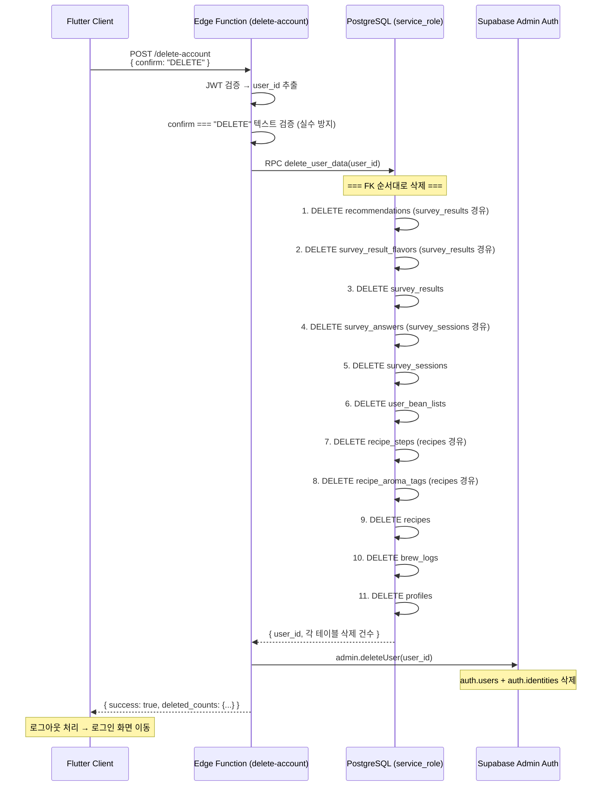

# 8. 계정 삭제 플로우

## 관련 리소스

| 구분 | 이름 | 역할 |
|------|------|------|
| **Edge Function** | `delete-account` | 계정 삭제 오케스트레이션 (**ACTIVE**, v2, `verify_jwt: true`) |
| **RPC** | `delete_user_data(p_user_id)` | public 스키마 전체 데이터 삭제 (SECURITY DEFINER) |

---

## 8-1. 계정 삭제 전체 플로우



## 8-2. 삭제 순서 (FK 의존성)

FK 참조 관계상 자식 테이블부터 삭제해야 한다:

```
삭제 순서 (번호 = 실행 순서):

 1. recommendations ─────────────┐
 2. survey_result_flavors ────────┤ survey_results의 자식
                                  │
 3. survey_results ◄──────────────┘
 4. survey_answers ──────────────┐
                                  │ survey_sessions의 자식
 5. survey_sessions ◄─────────────┘
 6. user_bean_lists
 7. recipe_steps ────────────────┐
 8. recipe_aroma_tags ────────────┤ recipes의 자식
                                  │
 9. recipes ◄─────────────────────┘
10. brew_logs
11. profiles ◄── 마지막 (auth.users FK 참조)

→ auth.users (Edge Function에서 admin.deleteUser)
```

## 8-3. 권한 및 보안

| 항목 | 설명 |
|------|------|
| `delete_user_data` | `SECURITY DEFINER` — 함수 소유자 권한으로 실행 |
| 인증 검증 | service_role이 아니면 `auth.uid() = p_user_id` 확인 |
| 본인 확인 | JWT의 user_id와 p_user_id 일치 필수 |
| confirm 검증 | 요청 body에 `confirm: "DELETE"` 텍스트 필수 — 실수 방지 |
| auth.users 삭제 | `admin.deleteUser()` — service_role 전용 |

### delete_user_data 응답

```json
{
  "user_id": "uuid",
  "recommendations": 5,
  "survey_result_flavors": 3,
  "survey_results": 1,
  "survey_answers": 20,
  "survey_sessions": 2,
  "user_bean_lists": 5,
  "recipe_steps": 6,
  "recipe_aroma_tags": 4,
  "recipes": 2,
  "brew_logs": 15,
  "profiles": 1
}
```

## 영향받는 테이블 전체 목록

| 테이블 | 삭제 조건 | 비고 |
|--------|-----------|------|
| `recommendations` | `result_id → survey_results.user_id` | 간접 FK |
| `survey_result_flavors` | `result_id → survey_results.user_id` | 간접 FK |
| `survey_results` | `user_id = target` | 직접 FK |
| `survey_answers` | `session_id → survey_sessions.user_id` | 간접 FK |
| `survey_sessions` | `user_id = target` | 직접 FK |
| `user_bean_lists` | `user_id = target` | 직접 FK |
| `recipe_steps` | `recipe_id → recipes.user_id` | 간접 FK |
| `recipe_aroma_tags` | `recipe_id → recipes.user_id` | 간접 FK |
| `recipes` | `user_id = target` | 직접 FK, 시스템 레시피(user_id=NULL)는 유지 |
| `brew_logs` | `user_id = target` | 직접 FK |
| `profiles` | `user_id = target` | 직접 FK |
| `auth.users` | admin.deleteUser | Edge Function에서 처리 |
| `auth.identities` | CASCADE | auth.users 삭제 시 자동 |

> **참조 데이터 영향 없음**: coffee_beans, bean_flavor_tags, survey_questions, survey_options, brew_methods, onboarding_survey는 삭제 대상이 아니다.
